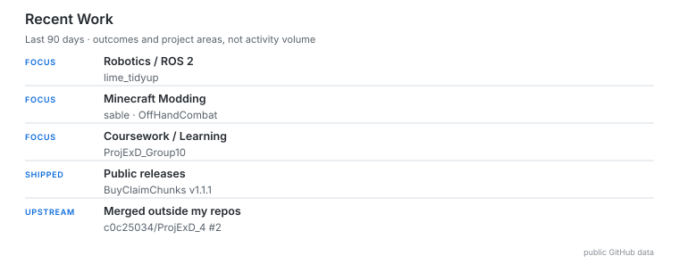

# Profile Activity Experiment

This branch compares the current volume-oriented GitHub activity card with an output-oriented `Recent Work` card designed to stay readable when commits, pull requests, and reviews are amplified by LLM-assisted development.

## A — Current profile signal

  <picture>
    <source media="(prefers-color-scheme: dark)" srcset="assets/github-stats-v2-dark.svg">
    <source media="(prefers-color-scheme: light)" srcset="assets/github-stats-v2-light.svg">
    
  </picture>

The current card exposes activity-volume metrics. Those numbers can increase dramatically from agent/LLM workflows without a proportional increase in shipped outcomes.

## B — Proposed profile signal

  <picture>
    <source media="(prefers-color-scheme: dark)" srcset="assets/recent-work-dark.svg">
    <source media="(prefers-color-scheme: light)" srcset="assets/recent-work-light.svg">
    
  </picture>

`Recent Work` intentionally omits total commits, PRs, reviews, LOC, and streak scoring. It shows only bounded signals from the last 90 days:

- `FOCUS`: at most 3 configured project areas, at most 2 repositories per area. Exact push count does not affect ranking; broad recency buckets and configured order are used instead.
- `SHIPPED`: at most 2 public releases.
- `UPSTREAM`: at most 2 merged PRs, and only for repositories explicitly allowlisted in `config/profile-activity.json`.

The current allowlist is empty, so a different repository owner alone is never treated as proof of external OSS contribution.

## Proposed profile hierarchy

If the experiment is accepted, the profile's durable evaluation layers become:

1. **Recent Work** — what areas are active and what has shipped.
2. **Interactive Project Map** — what projects exist and how they are organized.
3. **Contribution Activity** — a low-emphasis continuity signal, not a productivity score.

Total commit / PR / review counts should not return to the profile unless there is a new reason that survives LLM amplification.

## Policy source of truth

`config/profile-activity.json` defines the 90-day window and hard caps. `config/project-relations.json` provides the human-curated project/category order used to stabilize `FOCUS`.

## Before applying to `main`

- Compare A and B visually in GitHub's rendered Markdown.
- Confirm the `Recent Work → Project Map → Contribution Activity` hierarchy is easier to understand.
- Keep the 90-day window unless comparison reveals a clear problem.
- Add repositories to the upstream allowlist only after they are intentionally classified as real external OSS contribution targets.
- If accepted, fold `render_recent_work.py` into the normal profile update workflow, stop generating the old activity totals card, remove the branch-only preview workflow, then squash-merge PR #3.
