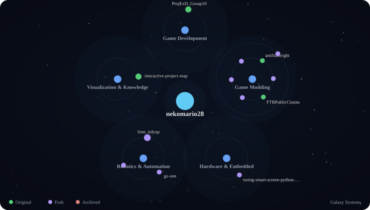

# Project Map Generator Comparison

This branch is an isolated comparison only. `main` remains unchanged.

## Current profile generator

Current path:

- profile-local Python generation
- `config/project-relations.json`
- `assets/project-map-dark.svg`
- `project-map/graph-data.json`

## Latest interactive-project-map Action

Comparison configuration:

- Action commit: `9307154077613337f29fed4ffe981f4cc73de915`
- style: `galaxy-systems`
- theme: `dark`
- max repositories: `100`
- forks: included
- archived: excluded
- output: `comparison/project-map-action/galaxy.svg` + `graph.json`

## Adoption decision

If the Action output is preferred, `main` can be simplified into a consumer of `interactive-project-map`: generate with a read-only token, transfer the result, then publish only the generated profile assets with write permission. The current profile-local Project Map renderer remains untouched until that comparison is accepted.
