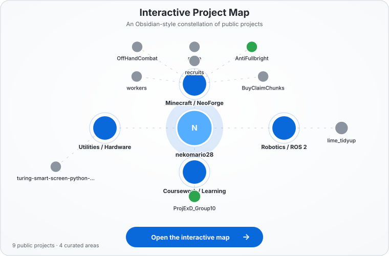
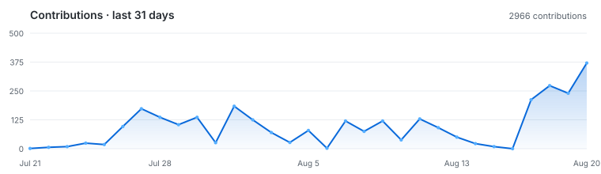

  

  ©2023 暁なつめ・三嶋くろね／KADOKAWA／このすば爆焔製作委員会

  <picture>
    <source media="(prefers-color-scheme: dark)" srcset="assets/github-stats-v2-dark.svg">
    <source media="(prefers-color-scheme: light)" srcset="assets/github-stats-v2-light.svg">
    
  </picture>

<!-- Featured Projects slot reserved. Generated card assets and workflow support are retained for later use. -->

 

<h2 align="center">Interactive Project Map</h2>

  Public projects arranged as a living galaxy.

  <a href="https://nekomario28.github.io/nekomario28/">
    <picture>
      <source media="(prefers-color-scheme: dark)" srcset="assets/project-map-dark.svg">
      <source media="(prefers-color-scheme: light)" srcset="assets/project-map-light.svg">
      
    </picture>
  </a>

  <a href="https://nekomario28.github.io/nekomario28/"><strong>Explore the live map ↗</strong></a> 
  Select projects · drag nodes · pan · zoom

 

  <picture>
    <source media="(prefers-color-scheme: dark)" srcset="assets/github-contributions-dark.svg">
    <source media="(prefers-color-scheme: light)" srcset="assets/github-contributions-light.svg">
    
  </picture>

  
  
  

