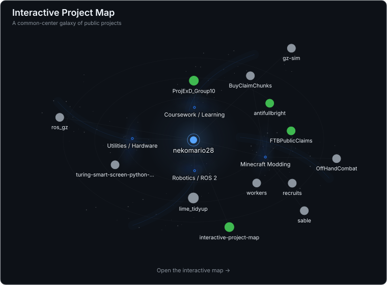

  

  ©2023 暁なつめ・三嶋くろね／KADOKAWA／このすば爆焔製作委員会

 

  <strong>Robotics / ROS 2 / Linux / Docker</strong>

 

<h2 align="center">Interactive Project Map</h2>

  Public projects arranged as a living galaxy.

  <a href="https://nekomario28.github.io/interactive-project-map/u/?username=nekomario28&style=galaxy">
     
    <strong>Explore the live map ↗</strong>
  </a> 
  Select projects · drag nodes · pan · zoom · switch styles

 

  

