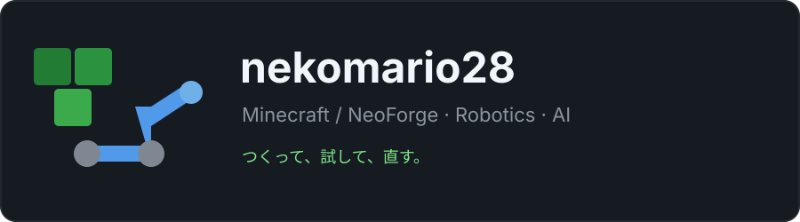

  

  大学でコンピュータサイエンスを学びながら、 
  <strong>Minecraft Mod</strong>と<strong>ロボティクス</strong>を触っています。

  <code>Java</code> <code>Python</code> <code>NeoForge</code>
  <code>ROS 2</code> <code>Docker</code> <code>Linux</code>

> **最近：** NeoForge と ROS 2 を行き来しています。  
> 気になったものをまず小さく動かして、挙動を確かめながら直していくのが好きです。

## GitHub の記録

  <picture>
    <source media="(prefers-color-scheme: dark)" srcset="assets/github-stats-dark.svg">
    <source media="(prefers-color-scheme: light)" srcset="assets/github-stats-light.svg">
    
  </picture>

  

  
  

  見に来てくれてありがとうございます。

