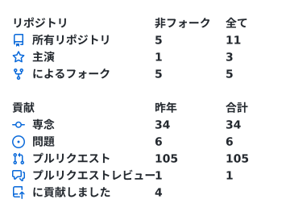
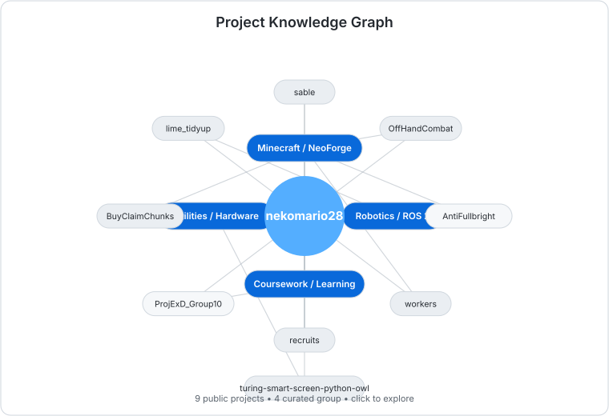

  

  ©2023 暁なつめ・三嶋くろね／KADOKAWA／このすば爆焔製作委員会

  <picture>
    <source media="(prefers-color-scheme: dark)" srcset="assets/github-stats-dark.svg">
    <source media="(prefers-color-scheme: light)" srcset="assets/github-stats-light.svg">
    
  </picture>

  <a href="https://github.com/nekomario28/civitas/blob/main/docs/KNOWLEDGE_GRAPH.md">
    <picture>
      <source media="(prefers-color-scheme: dark)" srcset="assets/knowledge-graph-dark.svg">
      <source media="(prefers-color-scheme: light)" srcset="assets/knowledge-graph-light.svg">
      
    </picture>
  </a>

  
  
  

