# Profile Design Lab

Experimental visual directions for the `nekomario28` GitHub profile.

The live profile is intentionally separate from this lab. Concepts can be compared, revised, or deleted here without turning the profile README into a gallery.

## Design lineage

| ID | Status | Meaning |
|---|---|---|
| D1 | archived | First animated neon/sakura SVG. Preserved exactly from commit `4fc69a45a60ad74a13ed75e46c40881bebb12880`. |
| D2 | archived lineage | Restrained indigo/sakura rewrite from commit `0c8aebb6c976c78e6ad940cf8f5a37c6db4883bd`. Useful as evidence, not the target aesthetic. |
| D3 | live system | Dark seasonal visual-envelope system. Four static-first seasonal heroes share one layout grammar. |

D1 and D2 are saved in `archive/`; neither should be silently overwritten when a later direction wins.

## D3 — dark seasonal concepts

### Spring

### Summer

### Autumn

### Winter

The palette and motif change, while the username placement, dark base, spacing rhythm, border geometry, and section-envelope grammar remain stable. All four current static variants have been rendered successfully at `900x260` and are approved by `theme-manifest.json` for seasonal promotion.

## Live promotion model

The root README never points directly at a seasonal experiment. It always references stable assets:

- `assets/profile-hero.svg`
- `assets/profile-divider.svg`
- `assets/profile-footer.svg`

`live-theme.json` records which seasonal source currently owns `assets/profile-hero.svg`. `scripts/promote-season.py` validates the month mapping, approval flags, SVG XML, and canonical `900x260` geometry before it can replace the stable hero.

This means seasonal switching does not rewrite README structure and remains easy to roll back.

## Seasonal mapping

`theme-manifest.json` maps in the `Asia/Tokyo` timezone:

- March–May -> spring
- June–August -> summer
- September–November -> autumn
- December–February -> winter

`.github/workflows/update-seasonal-profile.yml` checks on the first day of every month at about 09:17 JST. A scheduled run applies only when the resolved season differs from the active state. Manual dispatch defaults to dry-run.

The workflow also runs as a read-only validation on pushes that change the seasonal policy, scripts, state, or source SVGs.

## Visual envelope / pseudo-overlay

GitHub README content **cannot** place a real overlay over GitHub page chrome, the avatar/sidebar, pinned-repository UI, or other host-owned profile elements. README HTML/CSS/JS also cannot restyle the surrounding GitHub application.

What is implementable is a visual envelope **inside the profile README rendering area**:

`seasonal hero -> dark divider -> profile content -> dark divider -> activity/content -> closing footer`

On GitHub dark theme, dark full-width SVG bands visually blend with the host background and can make the README read as one continuous composition. This is a visual illusion/choreography, not DOM overlay authority.

See `envelope-demo.md` for the bounded implementation using repository-owned assets only.

## Current design authority

- target theme: **dark**
- copy: username/factual labels only; no invented motivational slogans
- motion: optional and secondary; static frame must remain complete
- structure: stable live assets are independent from the Design Lab
- culture-specific direction: use concrete composition/material/palette references; avoid postcard/tourist-symbol accumulation
- automatic mutation: only manifest-approved, static-rendered seasonal candidates may be promoted

## Promotion gate

A new seasonal variant is not eligible for automatic live promotion merely because it exists in `seasons/`. It must retain the common grammar, parse/render cleanly, and be explicitly marked `auto_promote=true` with `static_render=PASS` in the manifest. Unapproved experiments remain Design Lab-only.
