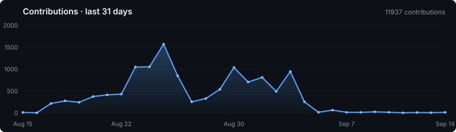

# Dark visual-envelope feasibility demo

This page demonstrates only what GitHub Markdown/README can actually own. It does **not** claim to overlay GitHub page chrome.

  

  

  

  

  

  

## Boundary

The dark bands can visually connect these blocks when GitHub itself is in dark theme. They cannot paint behind or over host-owned UI, and they cannot guarantee a seamless envelope in light theme. The experiment therefore treats **dark theme as explicit design authority**, not as an adaptive all-theme promise.
