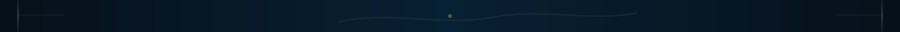

# Envelope v4 — segmented frame preview

  

  

©2023 暁なつめ・三嶋くろね／KADOKAWA／このすば爆焔製作委員会

  

The repeated bridge is intentionally thin. It carries only background continuity, side-edge cues, and a tiny seasonal motif. It is not a required content separator and may be omitted at transitions where it makes the reading rhythm worse.
